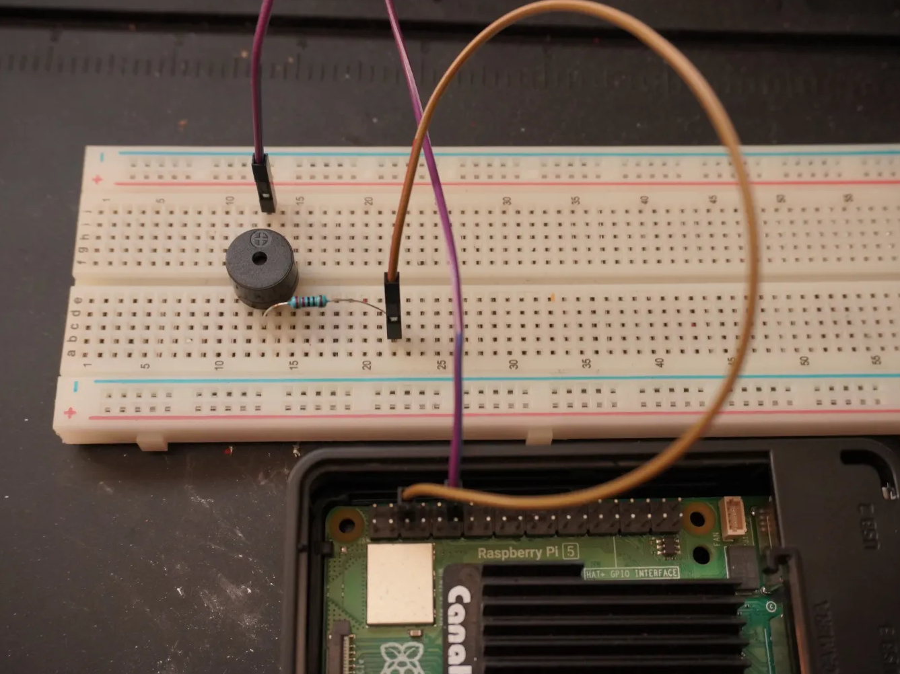

One night, my phone broke right before a school day, so I needed another way to wake up on time. To solve this, I built a simple alarm system using a Raspberry Pi, a breadboard, a passive buzzer module, jumper wires, and a resistor. I designed the circuit, connected it to the Raspberry Pi’s GPIO pins, and wrote a Python script to trigger the buzzer at a specific time. The project worked successfully and woke me up the next morning.

## Steps I followed to build the alarm system:

Step 1:
Connect the Raspberry Pi to a monitor and power it on.

Step 2:
Set up the breadboard and connect the passive buzzer module to the GPIO pins:

Connect the positive pin of the buzzer to GPIO 18
Connect the negative pin of the buzzer to GPIO 6
(Refer to the GPIO pin diagram below for guidance.)

Step 3:
Write a Python script (alarm_clock.py) to control the GPIO pins and trigger the buzzer at a scheduled time. Save the script in a folder.

Step 4:
Open the command-line interface (CLI), navigate to the folder containing your script, and run it:

cd /path/to/raspberrypiscripts
ls
python3 alarm_clock.py

Once executed, the buzzer will sound at the scheduled time, functioning as a simple alarm clock.

Note: If you use different GPIO pins than the ones listed, make sure to update the pin numbers in your Python script accordingly.

